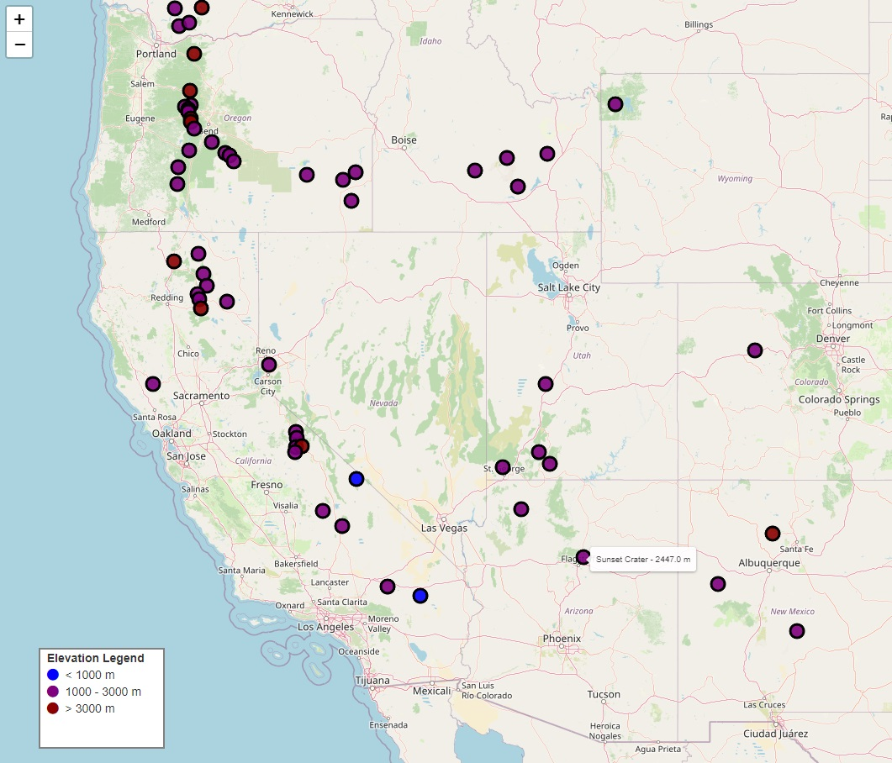

# Interactive Volcano Map 🌋

This project provides an interactive map that visualizes volcanoes in the United States. The map shows volcano locations with markers that vary in color based on elevation and include popups displaying the name, location, and elevation of each volcano. Users can switch between different map layers (e.g., OpenStreetMap, CartoDB) for customized viewing.

## Features

- **Volcano Markers**: Displays volcano locations with color-coded markers based on elevation.
  - Blue: Elevation < 1000 meters
  - Purple: Elevation between 1000 and 3000 meters
  - Dark Red: Elevation > 3000 meters
- **Popups and Tooltips**: Each marker provides volcano details like name, elevation, and location when clicked or hovered.
- **Multiple Tile Layers**: Users can toggle between different map backgrounds such as OpenStreetMap, CartoDB Positron, and CartoDB Dark Matter for different viewing styles.
- **Custom Legend**: Includes a legend explaining the elevation-based color coding of volcano markers.

## Technologies Used

- **Python**: Core language used to generate the map.
- **Folium**: Python library used to create the interactive map.
- **Pandas**: For loading and managing volcano data from CSV files.
- **HTML**: Generated by Folium to visualize the map.

## How to Run

1. Clone this repository to your local machine.
2. Ensure you have the necessary Python packages installed:
   ```bash
   pip install folium pandas
   ```

## Results


